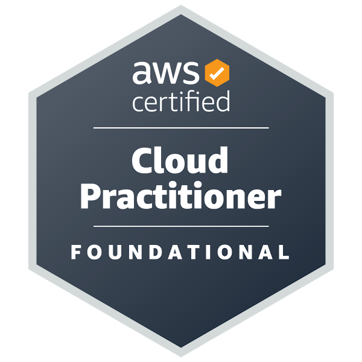

    

  

   

  

 

  ### 𐚁 _badges_ 

### 𐚁 _links_ 
- [ᴄᴏᴜʀꜱᴇʀᴀ ᴘʀᴏꜰɪʟᴇ](https://www.coursera.org/user/e00d7b8c3e86fbc67412bd06bf4919a7)  
   _explore my completed online courses on various topics._
- [ᴄʀᴇᴅʟʏ ᴄᴇʀᴛɪꜰɪᴄᴀᴛɪᴏɴꜱ](https://www.credly.com/users/kelly-cristina-moreira)  
   _view my earned certifications in cloud computing and other specialized areas._

